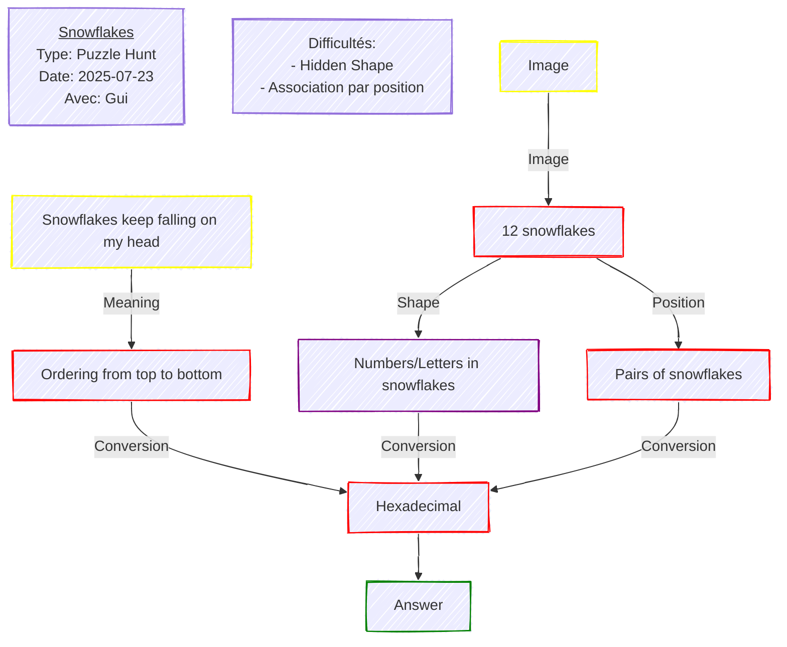

```mermaid
---
config:
  look: handDrawn
---
flowchart TD
  INFO[<u>Snowflakes</u>
    Type: Puzzle Hunt
    Date: 2025-07-23
    Avec: Gui]
  click INFO href "https://g1.glyph.wtf/hunt/ep/1/pz/4/" "Snowflakes"
  DIFF[Difficultés:
    - Hidden Shape
    - Association par position
  ]
%%%%%%%%%%%%%%%%%%%%%%%%%%%%%%%%%%%%%%%%%%%%

  TITLE[Snowflakes keep falling on my head]
  style TITLE stroke:yellow

  IMG1[Image]
  style IMG1 stroke:yellow

  ORDERING[Ordering from top to bottom]
  style ORDERING stroke:red

  TITLE --> |Meaning| ORDERING

  SF[12 snowflakes]
  style SF stroke:red

  IMG1 --> |Image| SF

  SFP[Pairs of snowflakes]
  style SFP stroke:red

  SF --> |Position| SFP

  NUMBER[Numbers/Letters in snowflakes]
  style NUMBER stroke:purple

  SF --> |Shape| NUMBER

  HEXA[Hexadecimal]
  style HEXA stroke:red

  Answer
  style Answer stroke:green

  ORDERING --> |Conversion| HEXA
  NUMBER --> |Conversion| HEXA
  SFP --> |Conversion| HEXA

  HEXA --> Answer
```
