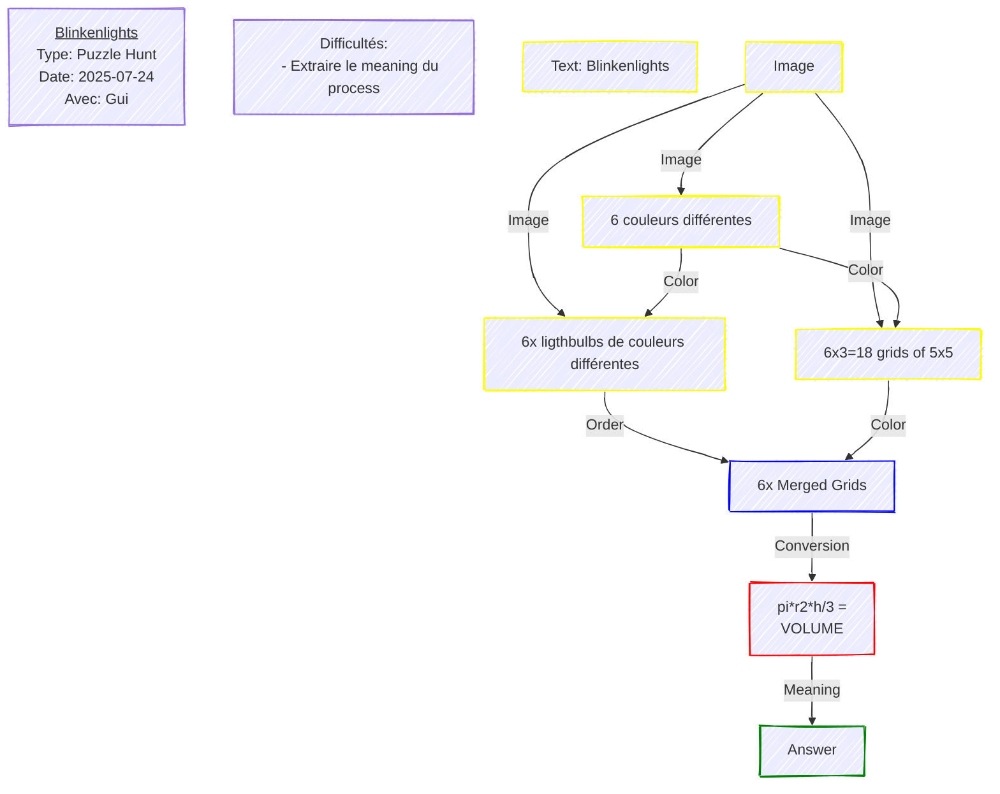

```mermaid
---
config:
  look: handDrawn
---
flowchart TD
  INFO[<u>Blinkenlights</u>
    Type: Puzzle Hunt
    Date: 2025-07-24
    Avec: Gui]
  click INFO href "https://g1.glyph.wtf/hunt/ep/1/pz/5/" "Blinkenlights"
  DIFF[Difficultés:
    - Extraire le meaning du process
  ]
%%%%%%%%%%%%%%%%%%%%%%%%%%%%%%%%%%%%%%%%%%%%

BL[Text: Blinkenlights]
style BL stroke:yellow
IMG1[Image]
style IMG1 stroke:yellow

GRID[6x3=18 grids of 5x5]
style GRID stroke:yellow
LB[6x ligthbulbs de couleurs différentes]
style LB stroke:yellow
COLOR[6 couleurs différentes]
style COLOR stroke:yellow


IMG1 --> |Image| GRID
IMG1 --> |Image| LB
IMG1 --> |Image| COLOR

COLOR --> |Color| GRID
COLOR --> |Color| LB

MG[6x Merged Grids]
style MG stroke:blue

LB --> |Order| MG
GRID --> |Color| MG

MG --> |Conversion| VOL

VOL[pi*r2*h/3 =
VOLUME]
style VOL stroke:red

VOL --> |Meaning| Answer

Answer
style Answer stroke:green

```
