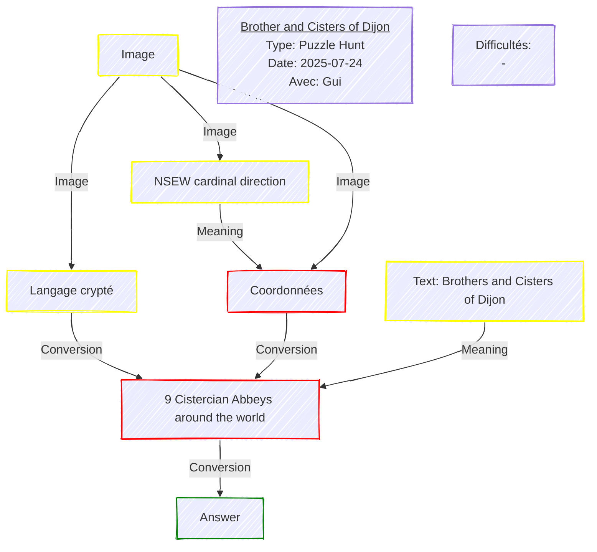

```mermaid
---
config:
  look: handDrawn
---
flowchart TD
%%%%%%%%%%%%%%%%%%%%%%%%%%%%%%%%%%%%%%%%%%%%

TITLE[Text: Brothers and Cisters of Dijon]
style TITLE stroke:yellow
IMG[Image]
style IMG stroke:yellow
LANG[Langage crypté]
style LANG stroke:yellow
COORD[Coordonnées]
style COORD stroke:red
NSEW[NSEW cardinal direction]
style NSEW stroke:yellow

NSEW --> |Meaning| COORD

IMG --> |Image| LANG
IMG --> |Image| COORD
IMG --> |Image| NSEW

ABBEY[9 Cistercian Abbeys around the world]
style ABBEY stroke:red

LANG --> |Conversion| ABBEY
COORD --> |Conversion| ABBEY
TITLE --> |Meaning| ABBEY

Answer
style Answer stroke:green

ABBEY --> |Conversion| Answer

%%%%%%%%%%%%%%%%%%%%%%%%%%%%%%%%%%%%%%%%%%%%%%%
  INFO[<u>Brother and Cisters of Dijon</u>
    Type: Puzzle Hunt
    Date: 2025-07-24
    Avec: Gui]
  click INFO href "https://g1.glyph.wtf/hunt/ep/1/pz/6/" "Brother and Cisters of Dijon"
  DIFF[Difficultés:
    -
  ]
```
