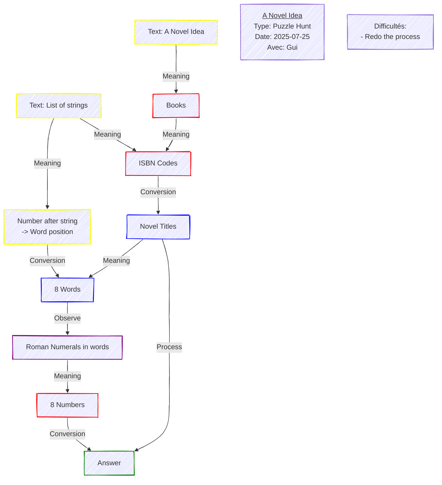

```mermaid
---
config:
  look: handDrawn
---
flowchart TD
    NOVEL[Text: A Novel Idea]
    style NOVEL stroke:yellow

    TEXT[Text: List of strings]
    style TEXT stroke:yellow

    NO[Number after string
        -> Word position]
    style NO stroke:yellow

    BOOK[Books]
    style BOOK stroke:red

    NOVEL --> |Meaning| BOOK
    TEXT --> |Meaning| NO

    ISBN[ISBN Codes]
    style ISBN stroke:red

    BOOK --> |Meaning| ISBN
    TEXT --> |Meaning| ISBN

    NT[Novel Titles]
    style NT stroke:blue

    ISBN --> |Conversion| NT

    WORDS[8 Words]
    style WORDS stroke:blue

    NO --> |Conversion| WORDS
    NT --> |Meaning| WORDS

    RN[Roman Numerals in words]
    style RN stroke:purple

    WORDS --> |Observe| RN

    NUMB[8 Numbers]

    RN --> |Meaning| NUMB

    NUMB --> |Conversion| Answer
    NT --> |Process| Answer

    Answer
    style Answer stroke:green
    style NUMB stroke:red

%%%%%%%%%%%%%%%%%%%%%%%%%%%%%%%%%%%%%%%%%%%%

  INFO[<u>A Novel Idea</u>
    Type: Puzzle Hunt
    Date: 2025-07-25
    Avec: Gui]
  click INFO href "https://g1.glyph.wtf/hunt/ep/1/pz/7/" "A Novel Idea"
  DIFF[Difficultés:
    - Redo the process
  ]
%%%%%%%%%%%%%%%%%%%%%%%%%%%%%%%%%%%%%%%%%%%%
```
