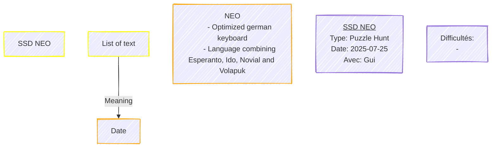

```mermaid
---
config:
  look: handDrawn
---
flowchart TD
    TITLE[SSD NEO]
    style TITLE stroke:yellow
    TEXT[List of text]
    style TEXT stroke:yellow

    DATE[Date]
    style DATE stroke:orange

    TEXT --> |Meaning| DATE

    NEO[NEO
        - Optimized german keyboard
        - Language combining Esperanto, Ido, Novial and Volapuk]
    style NEO stroke:orange

%%%%%%%%%%%%%%%%%%%%%%%%%%%%%%%%%%%%%%%%%%%%
  INFO[<u>SSD NEO</u>
    Type: Puzzle Hunt
    Date: 2025-07-25
    Avec: Gui]
  click INFO href "https://g1.glyph.wtf/hunt/ep/1/pz/8/" "SSD NEO"
  DIFF[Difficultés:
    -
  ]
%%%%%%%%%%%%%%%%%%%%%%%%%%%%%%%%%%%%%%%%%%%%
```
