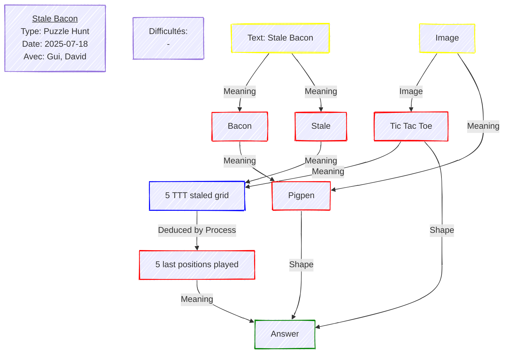

```mermaid
---
config:
  look: handDrawn
---
flowchart TD
  INFO[<u>Stale Bacon</u>
    Type: Puzzle Hunt
    Date: 2025-07-18
    Avec: Gui, David]
  click INFO href "https://g7.glyph.wtf/hunt/ep/1/pz/2/" "Stale Bacon"
  DIFF[Difficultés:
    -
  ]
%%%%%%%%%%%%%%%%%%%%%%%%%%%%%%%%%%%%%%%%%%%%
  TITLE[Text: Stale Bacon]
  style TITLE stroke:yellow
  IMG1[Image]
  style IMG1 stroke:yellow

  STALE[Stale]
  style STALE stroke:red
  BACON[Bacon]
  style BACON stroke:red
  TTT[Tic Tac Toe]
  style TTT stroke:red

  IMG1 --> |Image| TTT
  TITLE --> |Meaning| BACON
  TITLE --> |Meaning| STALE

  TTTS[5 TTT staled grid]
  style TTTS stroke:blue

  STALE --> |Meaning| TTTS
  TTT --> |Meaning| TTTS

  PIGPEN[Pigpen]
  style PIGPEN stroke:red

  BACON --> |Meaning| PIGPEN
  IMG1 --> |Meaning| PIGPEN

  LTTTP[5 last positions played]
  style LTTTP stroke:red

  TTTS --> |Deduced by Process| LTTTP

  TTT --> |Shape| Answer
  PIGPEN --> |Shape| Answer
  LTTTP --> |Meaning| Answer

  Answer
  style Answer stroke:green
```
