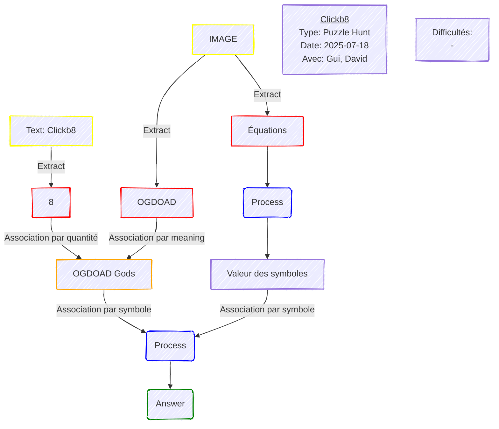

```mermaid
---
config:
  title: Clickb8
  look: handDrawn
---
flowchart TD
    Clickb8[Text: Clickb8] --> |Extract| 8

    IMG1[IMAGE] --> |Extract| Équations
    IMG1[IMAGE] --> |Extract| OGDOAD

    8 --> |Association par quantité| D1[OGDOAD Gods]
    OGDOAD --> |Association par meaning| D1

    Équations --> P1(Process)

    P1 --> Values[Valeur des symboles]

    D1 --> |Association par symbole| P2(Process)
    Values --> |Association par symbole| P2(Process)

    P2 --> Answer(Answer)

    %%%%%%%%%%%%%%%%%%%%%%%%%%%%%%%%%%%%%%%%%%%%%%%%%%%

    TITLE[<u>Clickb8</u>
        Type: Puzzle Hunt
        Date: 2025-07-18
        Avec: Gui, David
        ]

    click TITLE href "https://g7.glyph.wtf/hunt/ep/1/pz/3/" "Clickb8"
    DIFF[Difficultés:
    - ]

    %%%%%%%%%%%%%%%%%%%%%%%%%%%%%%%%%%%%%%%%%%%%%%%%%%%
    %%%%%%%%%%%%%%%%%%%%%%%%%%%%%%%%%%%%%%%%%%%%%%%%%%%
    classDef startingInfo stroke:yellow
    class Clickb8,IMG1 startingInfo

    classDef meaningExtraction stroke:red
    class Équations,OGDOAD,8,Pigpen meaningExtraction

    classDef process stroke:blue
    class P1,P2,P3,P4,P5 process

    classDef deduction stroke:orange
    class D1,D2,D3,D4,D5 deduction

    classDef answer stroke: green
    class Answer answer

    %%%%%%%%%%%%%%%%%%%%%%%%%%%%%%%%%%%%%%%%%%%%%%%%%%%
    %%%%%%%%%%%%%%%%%%%%%%%%%%%%%%%%%%%%%%%%%%%%%%%%%%%
```
