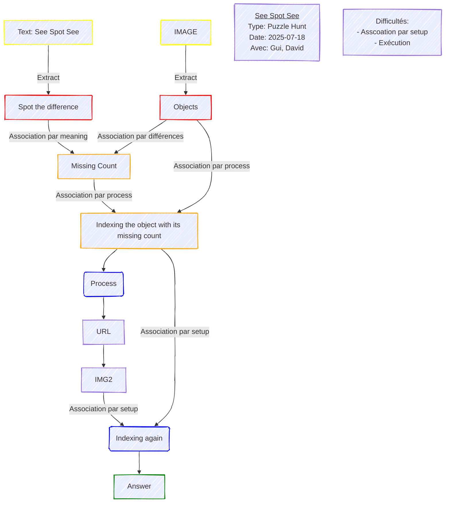

```mermaid
---
config:
  title: See Spot See
  look: handDrawn
---
flowchart TD
    SSS[Text: See Spot See] --> |Extract| STD[Spot the difference]

    IMG1[IMAGE] --> |Extract| Objects

    STD --> |Association par meaning| D1[Missing Count]
    Objects --> |Association par différences| D1

    Objects --> |Association par process| D2[Indexing the object with its missing count]
    D1 --> |Association par process| D2

    D2 --> P1(Process) --> URL --> IMG2

    IMG2 --> |Association par setup| P2(Indexing again)
    D2 --> |Association par setup| P2

    P2 --> Answer

    %%%%%%%%%%%%%%%%%%%%%%%%%%%%%%%%%%%%%%%%%%%%%%%%%%%

    TITLE[<u>See Spot See</u>
        Type: Puzzle Hunt
        Date: 2025-07-18
        Avec: Gui, David
        ]

    click TITLE href "https://g7.glyph.wtf/hunt/ep/1/pz/6/" "See Spot See"
    DIFF[Difficultés:
    - Asscoation par setup
    - Exécution ]

    %%%%%%%%%%%%%%%%%%%%%%%%%%%%%%%%%%%%%%%%%%%%%%%%%%%
    %%%%%%%%%%%%%%%%%%%%%%%%%%%%%%%%%%%%%%%%%%%%%%%%%%%
    classDef startingInfo stroke:yellow
    class SSS,IMG1 startingInfo

    classDef meaningExtraction stroke:red
    class STD,Objects,Pigpen meaningExtraction

    classDef process stroke:blue
    class P1,P2,P3,P4,P5 process

    classDef deduction stroke:orange
    class D1,D2,D3,D4,D5 deduction

    classDef answer stroke: green
    class Answer answer

    %%%%%%%%%%%%%%%%%%%%%%%%%%%%%%%%%%%%%%%%%%%%%%%%%%%
    %%%%%%%%%%%%%%%%%%%%%%%%%%%%%%%%%%%%%%%%%%%%%%%%%%%
```
