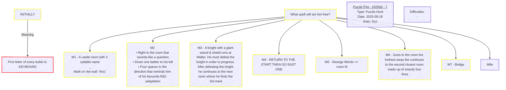

```mermaid
---
config:
  look: handDrawn
---
flowchart TD

INITIALLY[INITIALLY]
style INITIALLY stroke:yellow

KEYBOARD[First letter of every bullet is:
KEYBOARD]
style KEYBOARD stroke:red

INITIALLY --> |Meaning| KEYBOARD

SPELL[What spell will set him free?]
style SPELL stroke:yellow

M1[M1 - A castle room with 3 syllable name
_
Mark on the wall: 'first;']
style M1 stroke:yellow

M2[M2 
• Right to the room that sounds like a question
• Down one ladder to his left
• Four spaces in the direction that reminds him of his favourite R&J adaptation]
style M2 stroke:yellow

M3[M3 - A knight with a giant sword & shield runs at Walter. He must defeat the knight in order to progress. After defeating the knight he continues to the next room where he finds the 3rd mark]
style M3 stroke:yellow

M4[M4 - RETURN TO THE START THEN GO EAST ONE]
style M4 stroke:yellow

M5[M5 - Strange Words => room M]
style M5 stroke:yellow

M6[M6 - Goes to the room the furthest away the continues to the second closest room made up of exactly four lines]
style M6 stroke:yellow

M7[M7 - Bridge]
style M7 stroke:yellow

SPELL --> M1
SPELL --> M2
SPELL --> M3
SPELL --> M4
SPELL --> M5
SPELL --> M6
SPELL --> M7
SPELL --> M8e

%%%%%%%%%%%%%%%%%%%%%%%%%%%%%%%%%%%%%%%%%%%%
  INFO[<u>Puzzle Pint - 202506 - 7</u>
    Type: Puzzle Hunt
    Date: 2025-09-19
    Avec: Gui]
  click INFO href "https://puzzledpint.org/events/june-2025/" "Puzzle Pint - 202506 - 7"
  DIFF[Difficultés:
    -
  ]
%%%%%%%%%%%%%%%%%%%%%%%%%%%%%%%%%%%%%%%%%%%%
```