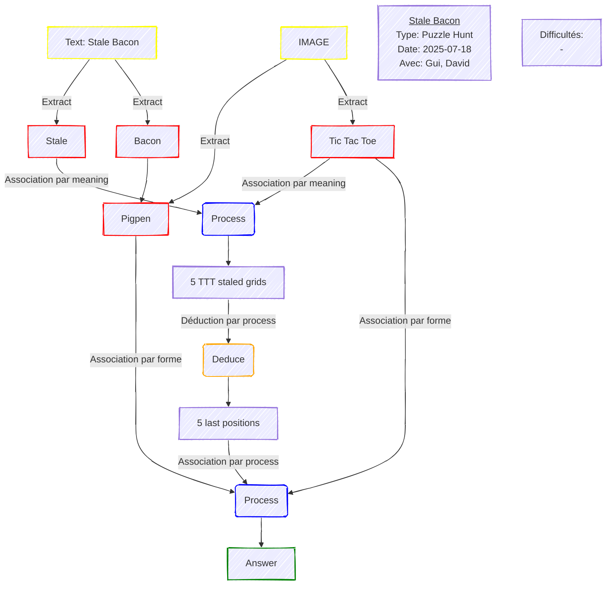

```mermaid
---
config:
  title: Stale Bacon
  look: handDrawn
---
flowchart TD
    StaleBacon[Text: Stale Bacon] --> |Extract| Stale
    StaleBacon --> |Extract| Bacon

    IMG1[IMAGE] --> |Extract| Pigpen
    IMG1[IMAGE] --> |Extract| TTT[Tic Tac Toe]

    Stale --> |Association par meaning| P1(Process)
    TTT --> |Association par meaning| P1(Process)

    Bacon --> Pigpen

    P1(Process) --> TTTR[5 TTT staled grids]

    TTTR --> |Déduction par process| D1(Deduce)

    D1 --> TTTP[5 last positions]

    TTT --> |Association par forme| P2(Process)
    TTTP --> |Association par process| P2
    Pigpen --> |Association par forme| P2

    P2 --> Answer

    %%%%%%%%%%%%%%%%%%%%%%%%%%%%%%%%%%%%%%%%%%%%%%%%%%%

    TITLE[<u>Stale Bacon</u>
        Type: Puzzle Hunt
        Date: 2025-07-18
        Avec: Gui, David
        ]

    click TITLE href "https://g7.glyph.wtf/hunt/ep/1/pz/2/" "Stale Bacon"
    DIFF[Difficultés:
    - ]

    %%%%%%%%%%%%%%%%%%%%%%%%%%%%%%%%%%%%%%%%%%%%%%%%%%%
    %%%%%%%%%%%%%%%%%%%%%%%%%%%%%%%%%%%%%%%%%%%%%%%%%%%
    classDef startingInfo stroke:yellow
    class StaleBacon,IMG1 startingInfo

    classDef meaningExtraction stroke:red
    class Bacon,Stale,TTT,Pigpen meaningExtraction

    classDef process stroke:blue
    class P1,P2 process

    classDef deduction stroke:orange
    class D1 deduction

    classDef answer stroke: green
    class Answer answer

    %%%%%%%%%%%%%%%%%%%%%%%%%%%%%%%%%%%%%%%%%%%%%%%%%%%
    %%%%%%%%%%%%%%%%%%%%%%%%%%%%%%%%%%%%%%%%%%%%%%%%%%%
```
